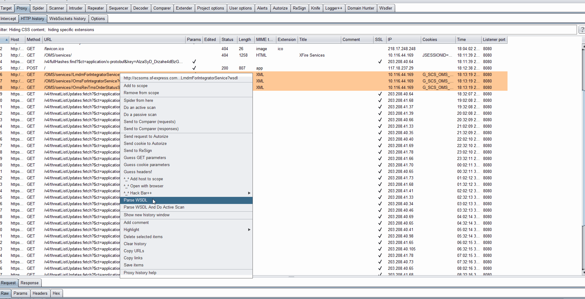
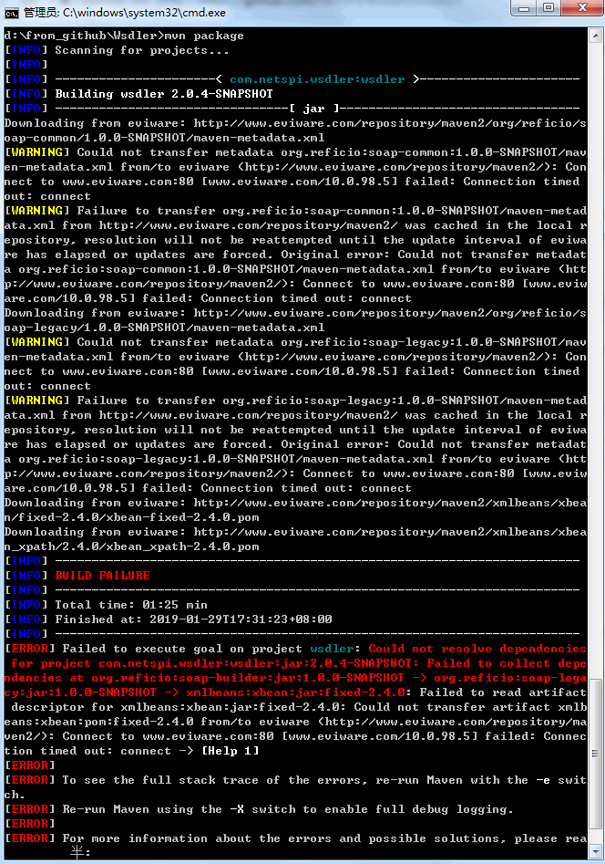

## Wsdler

WSDL Parser extension for Burp

##Change instructions (by [bit4woo](https://github.com/bit4woo/Wsdler))

1. support to selcet multiple WSDL request to parse.  支持同时选择多个wsdl的请求进行解析
2. support to select multiple WSDL request to parse and do active scan. 支持同时选择多个wsdl的请求进行解析并立即进行主动扫描。

##original project

https://github.com/NetSPI/Wsdler

## some  tips for building this project

1.  when you encounter the "connection timed out " error to www.eviware.com .  refer this https://github.com/reficio/soap-ws/issues/60    and  change your local host file. add a item :  "50.57.35.40 [www.eviware.com](http://www.eviware.com/)" . 50.57.35.40 is the IP address of smartbearsoftware.com

